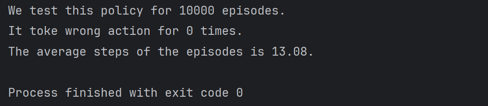
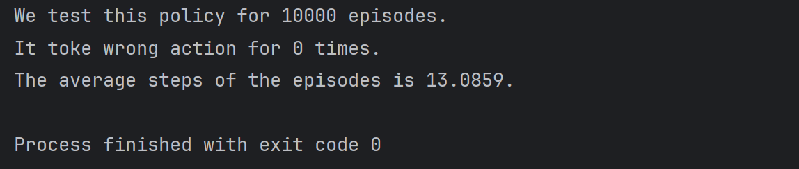

# README

​		

​		（半成品）

​		我已经进行了相关理论算法的学习，正在尝试实现gym_taxi项目。


## Taxi_policyIteration

​		这是我利用朴素的 model based 的策略迭代算法实现的项目。

#### 		理论：

​		我们随意构造policy $\pi_0$，反复使用policy_evaluation和policy_improvement得到条( policy - state_value )链：
$$
\pi_0 \to v_{\pi_0} \to \pi_1 \to v_{\pi_1} \to \ ...\ \to \pi_k \to v_{\pi_k} \to  \pi_{k+1} \to  \ ...
$$
直至policy $\pi$ 收敛。

​		**policy_evaluation：**当已有policy $\pi_k$ 时，以此计算state_value $v_{\pi_k}$ 的值，随意取初始state_value $v_{\pi_k}^{(0)}$，利用公式迭代：
$$
v_{\pi_k}^{(t+1)}=f(v_{\pi_k}^{(t)})= r_{\pi_k} + \gamma P_{\pi_k} v_{\pi_k}^{(t)}
$$

直至 $v_{\pi_k}$ 收敛。

​		**policy_iteration：**根据计算出的state_value $v_{\pi_k}$ ，我们依据公式改进policy $\pi_k$ 为 $\pi_{k+1}$：
$$
\pi_{k+1} = \arg\max_\pi (\ r_\pi + \gamma P_\pi v_{\pi_k} \ )
$$
具体的，有：
$$
a^*(s) = \arg\max_a (\ r(a|s)+ \gamma v_{\pi_k}(s') \ ) \ , \  \ \ s\stackrel{a}{\longrightarrow} s'
\\
\pi_{k+1}(a|s)=[a=a^*(s)]
$$

#### 	Taxi_policyIteration_getPolicy.py：

​		该代码对上述算法进行了实践。我选取discount_rate $\gamma = 0.9$ ，对策略迭代了100次，认为 $\pi_{100}$ 是最终收敛的policy。 其核心代码为：

```python
get_model() #对于model_based的算法，预处理出一个字典，记录每个(state, acton)pair会来到的新状态
round = 100
for i in range(0, round): #迭代100次
    get_P() #处理出P矩阵
    get_R() #处理出r向量
    iteration_state_value() #用迭代法计算state_value
    update_policy() #更新policy
```

#### 	Policy.csv：

​		Taxi_policyIteration_getPolicy.py将最终得到的policy保存为Policy.csv文件方便检验时读取。

#### 	Taxi_policyIteration_performance.py：

​		该代码使用gym接口得到了gym-taxi项目的环境。我们随机设置一个初始状态，可视化地渲染每一帧，可以观察到出租车的行为。

#### Taxi_policyIteration_test.py：

​		该代码使用gym接口得到了gym-taxi项目的环境，并读取Policy.csv文件。通过执行多个episode来对policy进行评估。以下为某次执行结果，包括错误的载客送客操作总数和运送乘客的平均步数。



#### State_value.csv：

​		Taxi_policyIteration_getPolicy.py将迭代过程中所有历史时刻的state_value记录下来，保存为State_value.csv文件，方便可视化时读取。

#### Taxi_policyIteration_visualization.py：

​		该代码读取了State_value.csv文件，并选取了( passenger_index=1 , destination_index=0 )和( passenger_index=4 , destination_index=0 )两种状态的地图，利用matplotlib库画出不同迭代次数下state_value的3D曲面图，在figure文件夹下生成一系列图片figure.jpg，并将其合成为state_value_iteration(1,0).gif和state_value_iteration(4,0).gif动画。

#### state_value_iteration(1,0).gif and state_value_iteration(4,0).gif：

​		可视化成果。


## Taxi_MC

​		做废了，搁置。


## Taxi_Q-learning

​		这是我利用的 model free 的 Q-leaning 算法实现的项目。

#### 理论：

​		Q-leaning 算法的本质是求解一个如下形式的贝尔曼最优方程：
$$
q(s,a)=\mathbb{E} [R_{t+1}+\gamma \max_{a^*}q(S_{t+1},a^*)| S_t=s, A_t=a],\quad \forall s,a
$$
​		我们首先大量取样，得到大量 $(s_t,a_t,r_{t+1},s_{t+1})$ tuple，套用RM公式，写出通过大量数据来估计 $q(s,a)$ 的迭代公式：
$$
q_{k+1}(s_t,a_t)=
(1-\alpha_k)q_k(s_t,a_t)+\alpha_k[r_{t+1}+\gamma \max_{a^*}q_k(s_{t+1},a^*)],
\\
q_{k+1}(s,a)=q_{k}(s,a),\quad \forall (s,a) \ne (s_t,a_t)
$$
​		得到了 $q(s,a)$ 后，我们就能写出相应的policy $\pi$ ：
$$
\pi(a|s)=[a = \arg \max_{a^*}q(s,a^*)]
$$

#### 	Taxi_Q-learning_getPolicy.py：

​		该代码对上述算法进行了实践。我选取discount_rate $\gamma = 0.9$ ，$\gamma=0.1$ ，并在采样过程中采用 $\epsilon=0.1$ 的 $\epsilon $-greedy。我们产生了100000轮episode，认为此时的q_table是最终收敛的。 其核心代码为：

```python
for rd in range(0,round):
    obs, info = env.reset()
    ter = False
    while not ter:
        ac = get_rand_ac(obs)
        obs_new, re, ter, tun, info = env.step(ac)
        q_table[obs][ac] = (1 - gamma) * q_table[obs][ac] + gamma * (re + discount_rate * np.max(q_table[obs_new]))
        obs = obs_new
```

#### q_table.csv

​		Taxi_Q-learning_getPolicy.py将最终得到的q_table保存为q_table.csv文件方便检验时读取。

#### 	Taxi_Q-learning_performance.py：

​		该代码使用gym接口得到了gym-taxi项目的环境。我们随机设置一个初始状态，可视化地渲染每一帧，可以观察到出租车的行为。

#### Taxi_Q-learning_test.py：

​		该代码使用gym接口得到了gym-taxi项目的环境，并读取q_table.csv文件。通过执行多个episode来对policy进行评估。以下为某次执行结果，包括错误的载客送客操作总数和运送乘客的平均步数。



#### State_value.csv：

​		Taxi_Q-learning_getPolicy.py将迭代过程中所有历史时刻的state_value记录下来(我们认为 $v(s)=\max_a q(s,a)$ )，保存为State_value.csv文件，方便可视化时读取。

#### Taxi_Q-learning_visualization.py：

​		该代码读取了State_value.csv文件，并选取了( passenger_index=1 , destination_index=0 )和( passenger_index=4 , destination_index=0 )两种状态的地图，利用matplotlib库画出每20次迭代下state_value的3D曲面图，在figure文件夹下生成一系列图片figure.jpg，并将其合成为state_value_iteration(1,0).gif和state_value_iteration(4,0).gif动画。

#### state_value_iteration(1,0).gif and state_value_iteration(4,0).gif：

​		可视化成果。
